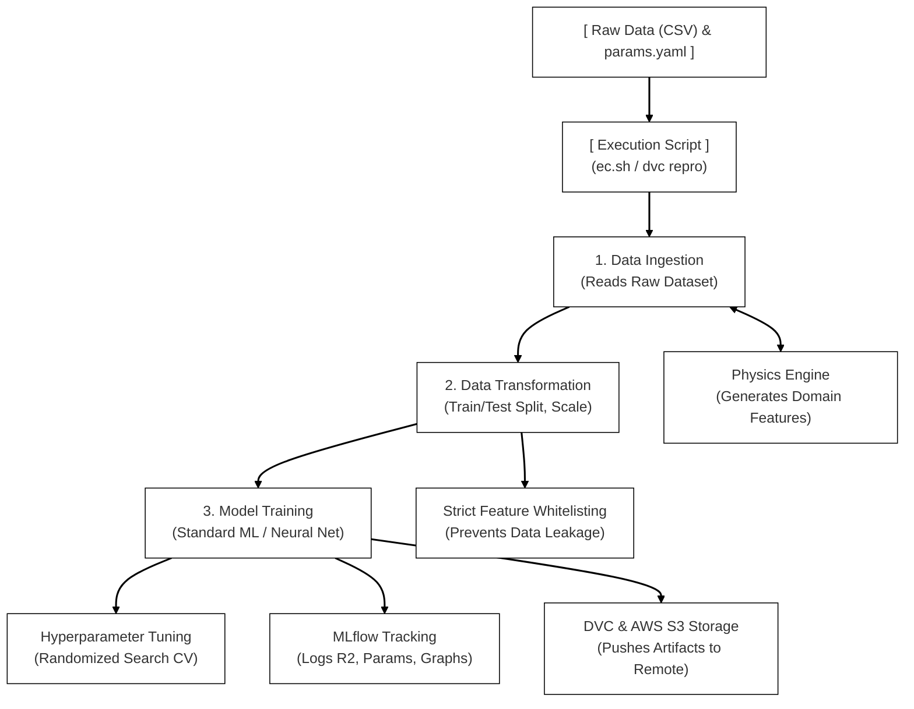

# Vented Disc Brake Rotor: Physics-Informed MLOps Pipeline

This repository contains an end-to-end, enterprise-grade Machine Learning Operations (MLOps) pipeline designed to predict the thermal and structural behavior of a Vented Disc Brake Rotor. By combining Ansys simulation data with a custom **Physics Engine**, this project implements Physics-Informed Machine Learning (PIML) to achieve high predictive accuracy.

The pipeline is fully automated, configuration-driven, and tracked using **DVC**, **MLflow**, and **Git**, with heavy artifact storage deployed to **AWS S3**.

---

## 🏗️ System Architecture



---

## 🛠️ MLOps Tech Stack

*   **Machine Learning Engine:** Scikit-Learn, XGBoost, TensorFlow/Keras
*   **Orchestration & Versioning:** DVC (Data Version Control), Git
*   **Experiment Tracking:** MLflow (SQLite backend)
*   **Cloud Storage:** AWS S3 (for `.pkl`, `.keras`, and dataset tracking)

---

## ⚙️ Pipeline Configuration (`params.yaml`)

The entire MLOps pipeline is decoupled from the Python codebase. You control the execution, data engineering, and model training strictly through the `params.yaml` file. 

Below is the complete list of every available parameter and its exact acceptable values.

### 1. Pipeline Control
**Parameter:** `log_to_mlflow`
*   `true`: Activates the MLflow tracking server. Records parameters, metrics (Global R2 score), and saves the serialized models directly to the local SQLite database.
*   `false`: Runs the pipeline locally for rapid testing without recording the experiment to MLflow.

### 2. Data Transformation (Physics Engine)
**Parameter:** `physics_mode`
*   `"none"`: Baseline Machine Learning. Skips the Physics Engine entirely and trains the model strictly on raw, unmodified dataset features.
*   `"heat_flow_only"`: Thermal Physics Mode. Calculates and injects `Engineered Heat Flow [W]`, `Disc Face Area [m^2]`, and `Engineered Heat Flux [W/m^2]`.
*   `"torque_only"`: Mechanical Physics Mode. Calculates and injects `Braking Torque [N.m]` based on vehicle mass and velocity equations.
*   `"full"`: Maximum Physics-Informed ML. Injects all thermal and mechanical domain features into the dataset simultaneously.

### 3. Model Selection
**Parameter:** `model_name`
*   `"LinearRegression"`: Standard linear approach (Note: ignores hyperparameter tuning).
*   `"Ridge"`: Linear model with L2 regularization.
*   `"Lasso"`: Linear model with L1 regularization.
*   `"DecisionTree"`: Single tree-based regression algorithm.
*   `"RandomForest"`: Bagging ensemble of decision trees.
*   `"ExtraTrees"`: Extremely randomized trees for high variance reduction.
*   `"GradientBoosting"`: Sequential ensemble boosting algorithm.
*   `"XGBoost"`: Highly optimized gradient boosting framework.
*   `"KNeighbors"`: K-Nearest Neighbors regression algorithm.
*   `"SVR"`: Support Vector Regression.
*   `"NeuralNetwork"`: Custom Keras/TensorFlow Deep Learning architecture (Supports dynamic layers, Dropout, BatchNorm, and variable Optimizers/Loss functions).

### 4. Hyperparameter Tuning
**Parameter:** `hyperparameter_tuning`
*   `true`: Triggers `RandomizedSearchCV` (or custom random sampling for Keras) to search through the massive parameter grids defined at the bottom of the `params.yaml` file, automatically selecting the best model.
*   `false`: Bypasses the search grid and trains the selected model almost instantly using a single set of default, baseline parameters.

---

## 🚀 How to Run the Pipeline

### 1. Configure the Experiment
Open `params.yaml` and select your desired `model_name`, `physics_mode`, and tuning preferences.

### 2. Execute the Pipeline
Run the following command in your terminal. DVC will automatically detect changes, calculate dependencies, and execute the required stages (Ingestion -> Transformation -> Training).
```powershell
dvc repro
```

### 3. Review Results in MLflow
If `log_to_mlflow` is enabled, launch the MLflow UI to view your R2 scores, parameters, and generated artifacts (such as the Neural Network learning curve).
```powershell
mlflow ui --backend-store-uri sqlite:///mlruns.db
```
*Navigate to `http://127.0.0.1:5000` in your web browser.*

### 4. Save and Push to Cloud
Once you are satisfied with a model run, lock the exact state into Git and push the heavy artifacts to AWS S3.
```powershell
# Send heavy files (.pkl, .keras, datasets) to AWS S3
dvc push

# Track the pipeline state and configurations
git add dvc.lock params.yaml

# Commit and push to remote repository
git commit -m "Experiment: Trained model with selected configuration"
git push origin main
```